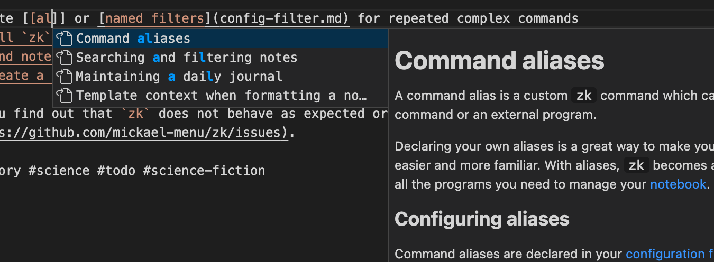
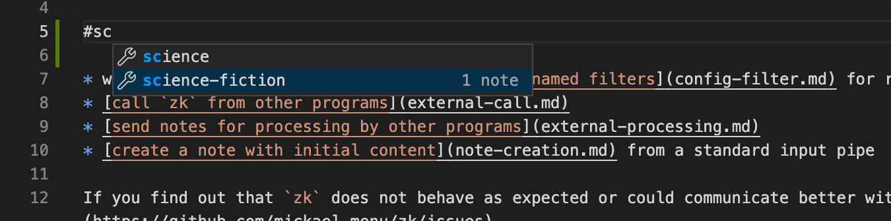
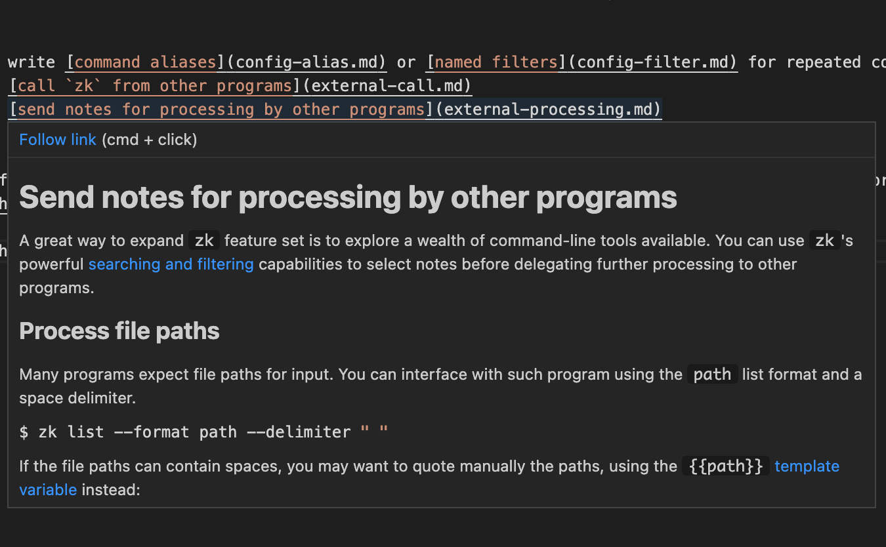
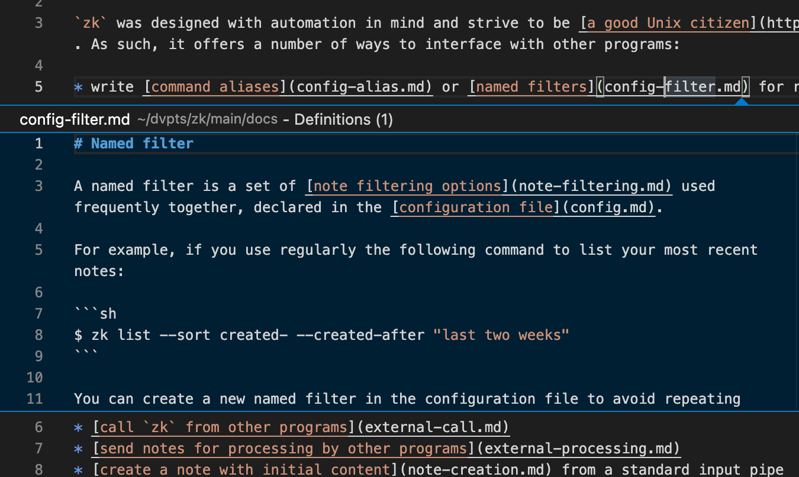

<div align="center">
<h1>zk-vscode</h1>
<h4>A Visual Studio Code extension for <a href="https://github.com/zk-org/zk"><code>zk</code></a></h4>
<h5><a href="https://marketplace.visualstudio.com/items?itemName=mickael-menu.zk-vscode"><b>Install from the Marketplace</b></a></h5>
</div>


## Description

[`zk`](https://github.com/zk-org/zk) is a command-line tool helping you to maintain a plain text [Zettelkasten](https://zettelkasten.de/introduction/) or [personal wiki](https://en.wikipedia.org/wiki/Personal_wiki). It provides a Language Server to augment LSP-compatible editors with many features such as auto-completion and navigation.

`zk-vscode` is a Visual Studio Code client extension for `zk`'s Language Server.

### Highlights

* Follow note links (including Wiki-links)

* Complete links ([configure Wiki-links in `zk`'s configuration file](https://github.com/zk-org/zk/blob/main/docs/note-format.md))

    

* Complete tags

    

* Preview a note on hover

    

* Peek a note with "Peek definition"

    

## Troubleshooting issues

If you experience issues with `zk-vscode`, you can peek at the Language Server logs with the **zk: Show Logs** VS Code command. To get more detailed logs, set the verbose mode in your `settings.json`:

```json
{
    "zk.trace.server": "verbose"
}
```
